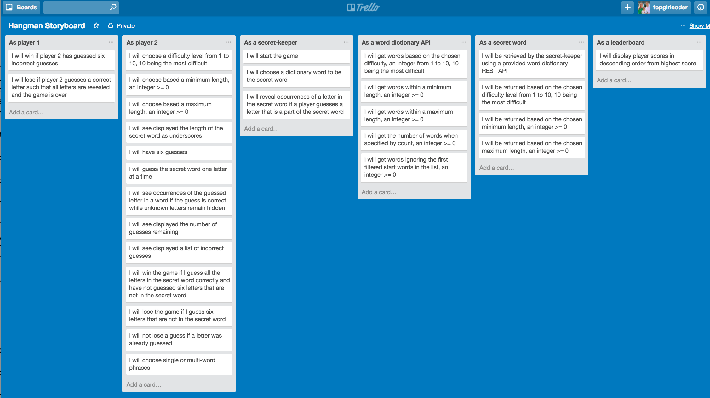
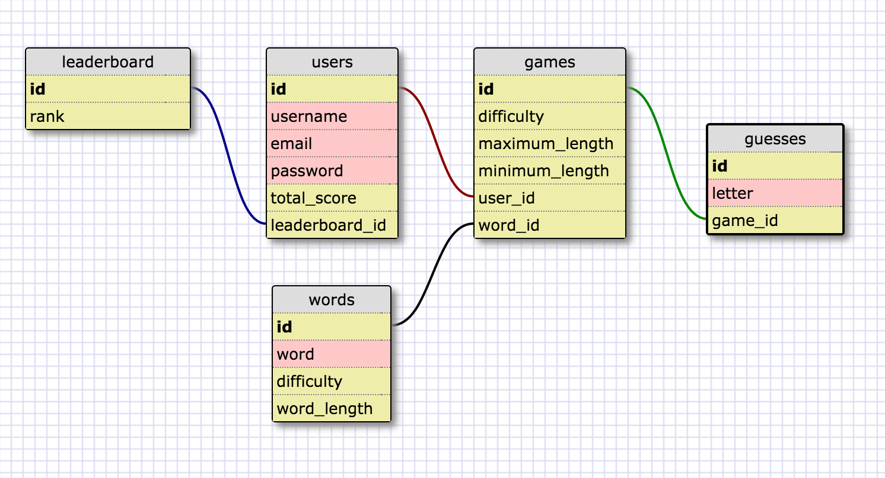

#Hangman
github.com/topgirlcoder/hangman

## Thanks for giving me the opportunity to build this project. I had fun making it!

##Game Summary
Hangman is a guessing game where one player thinks of a word, phrase or sentence and the other tries to guess it by suggesting letters, within a certain number of guesses.

##Game Rules:
  
  - A player starts with 6 lives per word. 
  - To win a game, a player guesses the word before 6 lives are up. 
  - A player that wins a game gets awarded points that equal the number of letters in the guessed word.
  - A player loses the game when 6 lives are lost and the word is not guessed.
  - A leaderboard is displayed to show user rankings.

## To run:
### 1. Download directory
### 2. In the terminal, cd into directory
### 3. Run: 

```
$ bundle install
``` 

```
$ bundle exec rake db:create
```

```
$ bundle exec rake db:migrate
```

```
$ bundle exec rails server
```

### 7. Open a browser window, type into the url: 
```
localhost:3000
```

### 8. Have fun playing the game!

##Project Summary
● Engineered RESTful backend utilizing Ruby on Rails to enable players to solve word challenges and gain points and rankings on a leaderboard.

● Architected PostgreSQL schema with 5+ tables, using eager loading in Rails to optimize by ~50% DB queries.

● Reduced front-end codebase by over 80% by creating modular view components with JavaScript and Ruby.

● Minimized HTTP to RESTful backend by >90% through utilizing jQuery, AJAX and Ruby on Rails helpers.

● Integrated LinkedIn API into Rails server to enable word searches for players.

##Technologies Utilized
Ruby, Rails,JavaScript, jQuery, AJAX, Git, PostgreSQL, HTML5, CSS3

##Hangman Wireframe

###Hangman Storyboard
 

###Hangman Schema Design Associations
 
